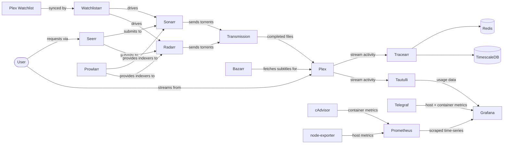

# AutoPlexx — Fully Automated Plex Media Server Setup

<div align="center">
    
</div>

<div align="center">

[](https://github.com/joshdev8/AutoPlexx/releases/latest)
[](LICENSE)
[](https://github.com/joshdev8/AutoPlexx/stargazers)
[](https://github.com/joshdev8/AutoPlexx/commits/main)
[](https://github.com/joshdev8/AutoPlexx/issues)
[](https://docs.docker.com/compose/)
[](https://www.plex.tv/)
[](#using-jellyfin-instead-of-plex)

</div>

A complete, opinionated [Plex Media Server](https://www.plex.tv/) stack delivered as a single [Docker Compose](https://docs.docker.com/compose/) file — bootstrap streaming, request handling, library automation, downloads, and monitoring with one command.

## Why AutoPlexx?

- **One command, full stack** — Plex, request handling (Seerr), library automation (Radarr/Sonarr), downloads, monitoring, and metadata curation all wired together. `docker compose up -d` and you're done.
- **Pre-built Kometa config included** — IMDb Top 250 / Trakt / streaming-service collections, daily rotating playlists, and resolution/HDR overlays are ready to run, not a blank YAML you fill in over weeks.
- **Network-isolated by design** — four separate Docker networks split streaming, request flow, downloading, and monitoring so a misbehaving service can't talk to the rest.
- **Stream analytics in the box** — Tracearr ships built-in for concurrent-stream monitoring, geolocation, and account-sharing detection alongside Tautulli's usage reporting.
- **Not locked to Plex** — a ready-to-run [Jellyfin](https://jellyfin.org/) service ships commented out, so swapping the media server is uncommenting a block rather than rebuilding the stack. [What that costs you](#using-jellyfin-instead-of-plex) is documented up front.

## Prerequisites

- [Docker](https://docs.docker.com/get-docker/) and [Docker Compose](https://docs.docker.com/compose/install/) (v2+)
- A Plex account and a [claim token](https://www.plex.tv/claim) — generate this **immediately before** your first `docker compose up`; claim tokens expire roughly 4 minutes after they're issued. Not needed if you're [running Jellyfin instead](#using-jellyfin-instead-of-plex)
- Values for `DB_PASSWORD`, `JWT_SECRET`, and `COOKIE_SECRET` in `.env` — Tracearr refuses to start without them and will fail the whole stack's `up` command
- OpenVPN credentials from a [supported VPN provider](https://haugene.github.io/docker-transmission-openvpn/supported-providers/) (`OPENVPN_PROVIDER`, `OPENVPN_CONFIG`, `OPENVPN_USERNAME`, `OPENVPN_PASSWORD`) — Transmission tunnels all traffic through OpenVPN and won't start without them. See [Transmission VPN setup](#transmission-vpn-setup) for details

## Getting Started

1. Clone the repository:

    ```bash
    git clone https://github.com/joshdev8/AutoPlexx.git
    cd AutoPlexx
    ```

2. Copy `.env.example` to `.env` and fill in your values:

    ```bash
    cp .env.example .env
    ```

3. Set `USERDIR` in `.env` to the parent directory where configs and media should live. All services bind-mount under `${USERDIR}/<service>`, so this one variable controls where everything lands — you don't normally need to edit `docker-compose.yml` itself.

4. Pre-create Seerr's config directory and give it to your `PUID:PGID`. Load the values from `.env` into your shell first so the paths expand correctly (or substitute the literal values from your `.env`):

    ```bash
    set -a; source .env; set +a
    mkdir -p "${USERDIR}/docker/seerr/config"
    sudo chown -R "${PUID}:${PGID}" "${USERDIR}/docker/seerr/config"
    ```

    Unlike the `linuxserver` images (Radarr, Sonarr, etc.), the Seerr container runs as a fixed non-root `node` user and does **not** honor `PUID`/`PGID` — it can't fix ownership itself. If this directory doesn't already exist, Docker creates it as `root` on first boot and Seerr crashes with `EACCES: permission denied, mkdir '/app/config/logs/'`. Creating it up front owned by your user avoids that.

5. Start all services:

    ```bash
    docker compose up -d
    ```

6. Open the dashboard at **<http://localhost:8090>** (or whatever `DASHBOARD_PORT` you set — `8090` is the default).

    There is nothing to configure — it shows every container's live status straight away, and links out to each service's own UI. As the rest of the stack finishes its first boot, the dashboard picks up each service's API key from the config file that service writes and lights up the corresponding panels on its own. See [Dashboard](#dashboard) for details.

## Common Operations

```bash
docker compose ps                                # show running services
docker compose logs -f <service>                 # tail one service's logs
docker compose restart <service>                 # restart one service after editing its config
docker compose pull && docker compose up -d      # update images (Watchtower also does this on a schedule)
docker compose down                              # stop everything (named volumes preserved)
docker compose config                            # validate YAML + env interpolation without starting anything
```

## Architecture



See [Network Architecture](#network-architecture) below for the exact network membership of each service.

## Screenshots

<!--
TODO: drop screenshots into a `docs/screenshots/` directory and reference them below.
Suggested captures: Plex web UI, Seerr discover page, Radarr/Sonarr libraries, Tautulli dashboard, Grafana panels, Tracearr dashboard.
-->

> Screenshots of the running stack — Plex, Seerr, Tautulli, Grafana, and Tracearr — coming soon. Contributions welcome via PR.

## Services

### Media Server

| Service | Description | Port |
|---------|-------------|------|
| [Plex](https://www.plex.tv/) | Central media server | `32400` (host network) |
| [Jellyfin](https://jellyfin.org/) | Open-source media server — optional drop-in *replacement* for Plex, shipped commented out | `8096` (host network) |

Pick one media server, not both — they'd index the same library twice. Plex is the
default and everything in the stack is wired for it; see [Using Jellyfin instead of
Plex](#using-jellyfin-instead-of-plex) below for the swap and what it costs you.

A ready-to-use [Kometa](https://kometa.wiki/) (Plex Meta Manager) configuration is included for automated collections and overlays, but Kometa itself is not part of `docker-compose.yml` — see [Kometa Configuration](#kometa-configuration) for how to run it.

### Using Jellyfin instead of Plex

Plex has moved features behind Plex Pass over time. If you'd rather run
[Jellyfin](https://jellyfin.org/) — free and fully open-source, no paid tier — the
stack ships a ready-to-use Jellyfin service, commented out in `docker-compose.yml`.

To switch:

1. In `docker-compose.yml`, comment out the entire `plex:` service.
2. Uncomment the `jellyfin:` service directly below it.
3. `docker compose up -d`. Jellyfin's web UI is at `http://<host>:8096` — no claim token needed.

**What still works, and what doesn't.** Jellyfin serves the same media library, but
several companions in this stack talk to Plex's API specifically:

| Works with Jellyfin as-is | Plex-only (won't work against Jellyfin) |
|---------------------------|------------------------------------------|
| Radarr, Sonarr, Prowlarr, Bazarr | Tautulli (Plex analytics) |
| Transmission | Watchlistarr (syncs the *Plex* watchlist) |
| | Kometa / Plex Meta Manager |
| | Maintainerr |

**Seerr needs reconfiguring, not replacing.** Seerr does support a Jellyfin backend,
but the media server is chosen during its setup and doesn't follow the compose swap. If
you already onboarded Seerr against Plex, re-point it at Jellyfin in **Settings →
Media Server** — otherwise approved requests keep going to a Plex server that is no
longer running, with no error to tell you so.

Because the dashboard's now-playing and poster panels read through Tautulli, those
panels are Plex-bound too. Jellyfin-native replacements (e.g. Jellystat) are a possible
future addition but aren't wired up here yet.

### Content Management

| Service | Description | Port |
|---------|-------------|------|
| [Seerr](https://github.com/seerr-team/seerr) | Content request and management interface | `5055` |
| [Radarr](https://radarr.video/) | Movie management and downloading | `7878` |
| [Sonarr](https://sonarr.tv/) | TV show management and downloading | `8989` |
| [Prowlarr](https://prowlarr.com/) | Indexer manager that feeds Radarr/Sonarr | `9696` |
| [Bazarr](https://www.bazarr.media/) | Subtitle management for Radarr/Sonarr libraries | `6767` |
| [FlareSolverr](https://github.com/FlareSolverr/FlareSolverr) | Cloudflare bypass proxy for Prowlarr indexers | `8191` |
| [Maintainerr](https://github.com/jorenn92/Maintainerr) | Rule-based Plex library cleanup (auto-remove watched/aged items) | `6246` |
| [Watchlistarr](https://github.com/nylonee/watchlistarr) | Syncs Plex watchlist to Radarr/Sonarr | N/A |
| [Decluttarr](https://github.com/ManiMatter/decluttarr) | Removes stalled / failed downloads from \*arr queues | N/A |
| [Checkrr](https://github.com/aetaric/checkrr) | Scans media files for codec / corruption issues | `8585` |
| [Cleanarr](https://github.com/se1exin/Cleanarr) | Finds and removes duplicate content | N/A |
| [Requestrr](https://github.com/darkalfx/requestrr) | Discord bot for content requests | `4545` |

### Downloading

| Service | Description | Port |
|---------|-------------|------|
| [Transmission (VPN)](https://github.com/haugene/docker-transmission-openvpn) | Torrent client with OpenVPN tunnel — [setup notes](#transmission-vpn-setup) | `9091` |

### Monitoring

| Service | Description | Port |
|---------|-------------|------|
| [Tautulli](https://tautulli.com/) | Plex usage monitoring | `8181` |
| [Grafana](https://grafana.com/) | Metrics visualization | `3000` |
| [Prometheus](https://prometheus.io/) | Time-series metrics database — scrapes cAdvisor + node-exporter | `9090` |
| [cAdvisor](https://github.com/google/cadvisor) | Per-container CPU / memory / network metrics | `8080` |
| [node-exporter](https://github.com/prometheus/node_exporter) | Host (CPU / disk / network) metrics | `9100` |
| [Telegraf](https://www.influxdata.com/time-series-platform/telegraf/) | Metrics collection agent | N/A |
| [Tracearr](https://github.com/connorgallopo/tracearr) | Stream tracking and account sharing detection | `3001` |
| [Portainer](https://www.portainer.io/) | Docker management UI ([note on socket access](#a-note-on-portainer)) | `9000` |
| AutoPlexx Dashboard | Unified status and launcher for the whole stack — [details](#dashboard) | `8090` (default, set by `DASHBOARD_PORT`) |

### Infrastructure

| Service | Description | Port |
|---------|-------------|------|
| [Watchtower](https://containrrr.dev/watchtower/) | Automated container updates | N/A |
| [TimescaleDB](https://www.timescale.com/) | Time-series database (used by Tracearr) | N/A (internal) |
| [Redis](https://redis.io/) | Cache/queue (used by Tracearr) | N/A (internal) |
| [docker-socket-proxy](https://github.com/Tecnativa/docker-socket-proxy) | Read-only Docker API for the dashboard — [why](#dashboard) | N/A (internal) |

### Not included but recommended

These services pair well with this stack but are not included in the default `docker-compose.yml`. See their respective docs to add them:

- **[Lidarr](https://lidarr.audio/)** - Music management and downloading
- **[Jackett](https://github.com/Jackett/Jackett)** - Torrent indexer aggregator (Prowlarr covers most use cases)

## Network Architecture

Services are isolated into separate Docker networks:

- **`monitoring_network`** - Tautulli, Grafana, Telegraf, Watchtower, Portainer, Prometheus, cAdvisor, node-exporter, Dashboard, docker-socket-proxy
- **`media_network`** - Seerr, Radarr, Sonarr, Prowlarr, Bazarr, FlareSolverr, Maintainerr, Checkrr, Dashboard
- **`download_network`** - Transmission, Watchlistarr, Cleanarr, Requestrr, Decluttarr, Radarr, Sonarr, Dashboard
- **`tracearr-network`** - Tracearr, TimescaleDB, Redis

Plex runs in host network mode for optimal streaming performance. Radarr and Sonarr are attached to both `media_network` (so Seerr, Prowlarr, and Bazarr can reach them) and `download_network` (so Watchlistarr and Transmission can reach them). The dashboard joins all three service networks because it aggregates from all of them, and reaches Plex through `host.docker.internal`.

### A note on Portainer

Portainer mounts the host's Docker socket (`/var/run/docker.sock`) so it can manage every container. **This grants the Portainer UI root-equivalent access to the host** — anyone who logs in can stop, restart, or exec into any container, including those handling secrets. Set a strong admin password on first launch and don't expose port `9000` to the public internet.

## Dashboard

The AutoPlexx Command Center — at **<http://localhost:8090>** by default, or whichever port `DASHBOARD_PORT` names — is a single pane over the whole stack. It has three views:

- **Command Center** — what's streaming now (Plex/Tautulli), active downloads with progress and ETA, pending requests (Seerr), the next episodes due (Sonarr), and a merged activity feed of recent grabs and imports.
- **Launcher** — every service as a tile with live status, linking to its own UI.
- **Setup** — which integrations are connected, and the one concrete step for anything that isn't.

Above them, a strip of CPU / memory / storage / network gauges from Prometheus and an at-a-glance `N / M up` health tile.

### Zero configuration

It works out of the box, with no required configuration. `DASHBOARD_PORT` (default `8090`) sets the published port; everything else the dashboard reads is optional and has a working default — see [`dashboard/README.md`](dashboard/README.md#environment) for the full list, including the `*_API_KEY` overrides you only need if you run a service outside this stack.

API keys are **not** something you paste in. Each service writes its own key to a config file — Sonarr, Radarr, Prowlarr and Bazarr to `config.xml`, Tautulli to `config.ini`, Seerr to `settings.json` — and the dashboard reads those files through the read-only `/discover` mounts declared in `docker-compose.yml`. Discovery re-runs while the dashboard is running, so on a first boot each panel lights up by itself within a minute of the service behind it coming up. No restart, no wizard.

The **Setup** view shows exactly where each integration stands, so you can watch them connect rather than guessing. Keys are read server-side and never sent to the browser.

Two things worth knowing:

- **Tautulli ships with its API disabled.** The dashboard will say so specifically rather than reporting a generic failure — enable it in Tautulli under Settings → Web Interface → API.
- **Transmission's RPC auth isn't discoverable**, since it lives in your `.env` rather than a config file. If you've set `TRANSMISSION_RPC_USERNAME` / `TRANSMISSION_RPC_PASSWORD`, the dashboard picks them up from the same variables Transmission does. The VPN card's provider and server come from `OPENVPN_PROVIDER` / `OPENVPN_CONFIG` for the same reason.

If you run one of these services outside this stack, set the matching `*_API_KEY` variable in `.env` and it takes precedence over discovery. `*_URL` variables (e.g. `SONARR_URL`) override where the dashboard looks for a service.

### Why a separate socket proxy

Container status has to come from the Docker API, but the dashboard does **not** mount the Docker socket. Note that `:ro` on a socket only affects the file node — it does not make the Docker API read-only — so a direct mount would be a second root-equivalent exposure alongside Portainer's.

Instead, `docker-socket-proxy` sits in front with `CONTAINERS=1` and everything else off. It permits `GET /containers/json` and denies the rest, including image access and `exec`. The dashboard talks HTTP to that proxy and never sees the socket.

### Security posture

The dashboard is **read-only** — it issues no mutating calls to any service — and it ships **no authentication**. Treat it as LAN-only.

By default Compose publishes it on all interfaces (`0.0.0.0`), which is what makes `http://<your-server>:8090` work from another machine on your LAN. **If you put it behind a reverse proxy for authentication, publishing on all interfaces lets anyone reach the dashboard directly and skip that proxy entirely.** Bind it to loopback so only the proxy can reach it:

```bash
# in .env
DASHBOARD_BIND=127.0.0.1
```

Then point your reverse proxy at `127.0.0.1:8090`. If the proxy runs in Docker rather than on the host, drop the `ports:` mapping for `dashboard` altogether and let the proxy reach it over a shared Docker network instead — a published port always bypasses the proxy. Restricting `8090` at the firewall works too, but the bind address is the harder thing to get wrong.

The same reasoning applies to every other service in this stack, none of which are authenticated by default either.

### Building it yourself

`docker compose up -d` pulls a prebuilt image, so no Node toolchain is needed. To build from source instead:

```bash
docker compose build dashboard && docker compose up -d dashboard
```

To work on it locally, see [`dashboard/README.md`](dashboard/README.md).

## Transmission VPN setup

Transmission uses the [`haugene/transmission-openvpn`](https://github.com/haugene/docker-transmission-openvpn) image, which runs an OpenVPN client inside the container and tunnels all torrent traffic through it. The container fails to start without valid VPN credentials.

**Required `.env` values:**

| Variable | What it is |
|----------|------------|
| `OPENVPN_PROVIDER` | Provider name from the [supported list](https://haugene.github.io/docker-transmission-openvpn/supported-providers/) (e.g. `MULLVAD`, `PIA`, `NORDVPN`) |
| `OPENVPN_CONFIG` | Server / region config name — provider-specific, see your provider's section in the linked docs |
| `OPENVPN_USERNAME` | VPN account username (the one you use to log into the VPN, not the provider portal) |
| `OPENVPN_PASSWORD` | VPN account password |
| `LOCAL_NETWORK` | CIDR of your LAN (default `192.168.0.0/16`) — traffic to these subnets bypasses the tunnel so the web UI stays reachable |

**Optional:**

- `TRANSMISSION_RPC_USERNAME` / `TRANSMISSION_RPC_PASSWORD` — auth for the Transmission web UI. Leave blank for no auth.

**Required compose capabilities** (already configured in `docker-compose.yml`, mentioned here in case you fork):

- `cap_add: [NET_ADMIN]`
- `devices: [/dev/net/tun]`

**Verifying the tunnel works:**

```bash
docker compose exec transmission curl -s https://ipinfo.io | grep -E '"(ip|country)"'
```

The IP and country in the response should match your VPN exit, not your home connection. If they match your home IP, the tunnel is not active — check `docker compose logs transmission` for OpenVPN errors.

**If the web UI on `:9091` is unreachable:** `LOCAL_NETWORK` probably doesn't cover the subnet your machine is on. Add your subnet (e.g. `192.168.1.0/24`) to `LOCAL_NETWORK`, comma-separated if you need multiple ranges, and restart the container.

## Kometa Configuration

The `plex-meta-manager/config/` directory contains a ready-to-use [Kometa](https://kometa.wiki/) configuration. Kometa itself is not in `docker-compose.yml` — run it as a one-shot container on whatever schedule you prefer (cron, systemd timer, or a separate compose file):

```bash
docker run --rm \
  -v "$(pwd)/plex-meta-manager/config:/config" \
  --env-file .env \
  kometateam/kometa
```

The bundled config drives:

- **Movies** - IMDb Top 250, TMDb trending, Trakt lists, Oscar categories, genre collections, streaming service collections, holiday collections, and more
- **TV Shows** - Popular/trending, streaming networks, genres, studios (Marvel, DC), year-based collections
- **Playlists** - Daily rotating playlists by genre (Action, Comedy, Animated, Family)
- **Overlays** - Resolution badges (4K, 1080p, 720p), HDR/Dolby Vision, IMDb Top 250, streaming service badges, show status (Airing/Ended/Canceled)

<a href="https://www.buymeacoffee.com/joshdev8" target="_blank"></a>
